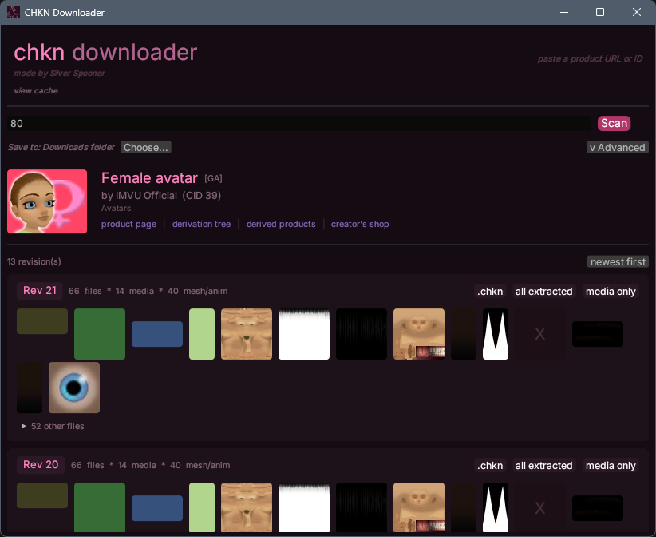

# chkn downloader



a little tool for grabbing IMVU product files — paste in a product ID or URL, it scans all the revisions and lets you download them however you want.

## what it does

- paste any IMVU product link or ID and it'll find all the versions of it
- shows you all the textures as previews, click one to see it full size
- download as a `.chkn` file, a folder of everything, or just the images
- has a cache tab where you can see what IMVU has already downloaded on your pc — you can scan anything from there or clear out the cache if it's taking up space

## download

grab the latest build from the [releases page](../../releases) — there's a windows and linux version.

## building yourself

you'll need rust installed, then just:

```bash
git clone https://github.com/ilovealienz/imvu-chkn-dl
cd imvu-chkn-dl
cargo build --release
```
